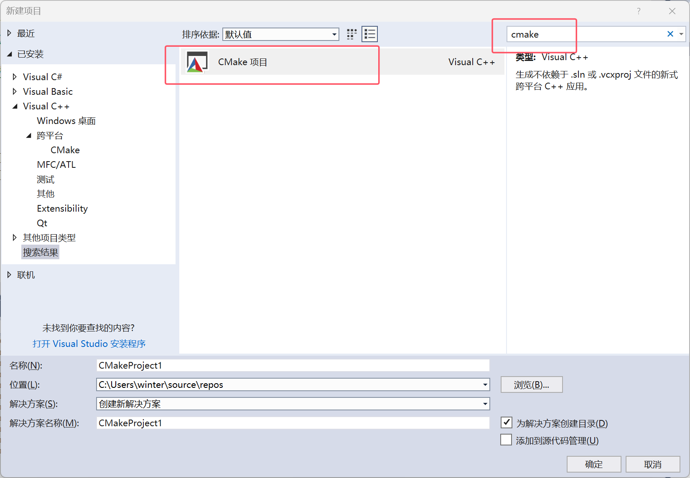
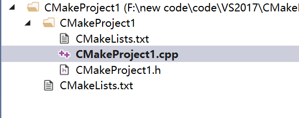
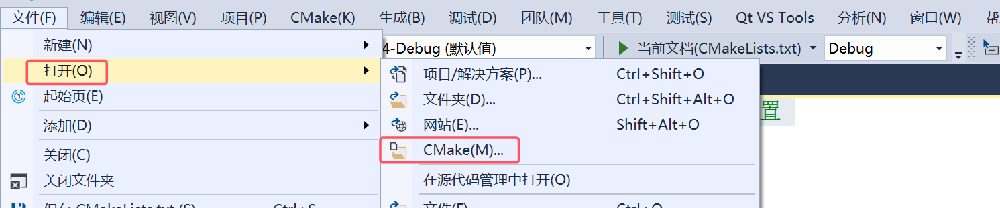
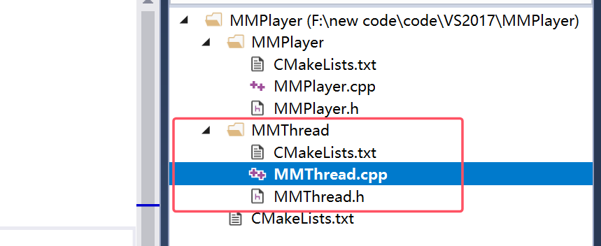
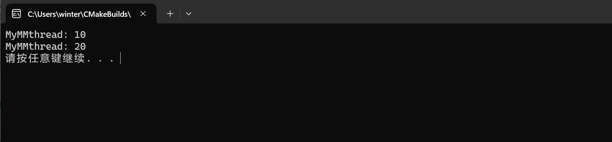
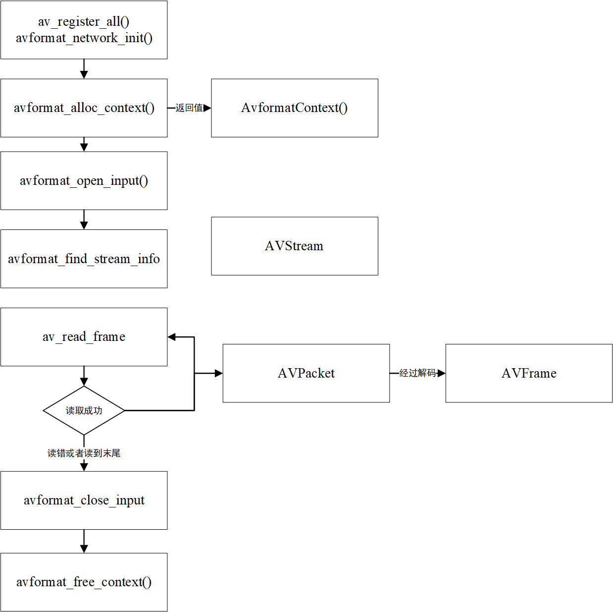
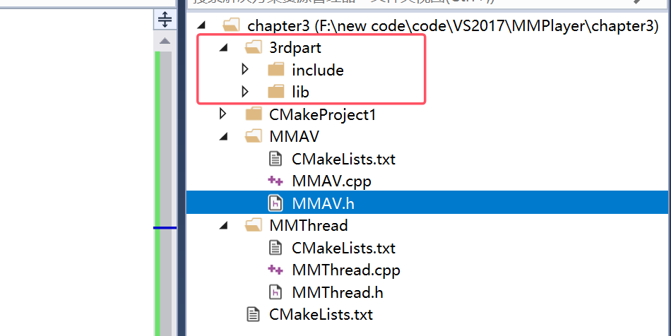
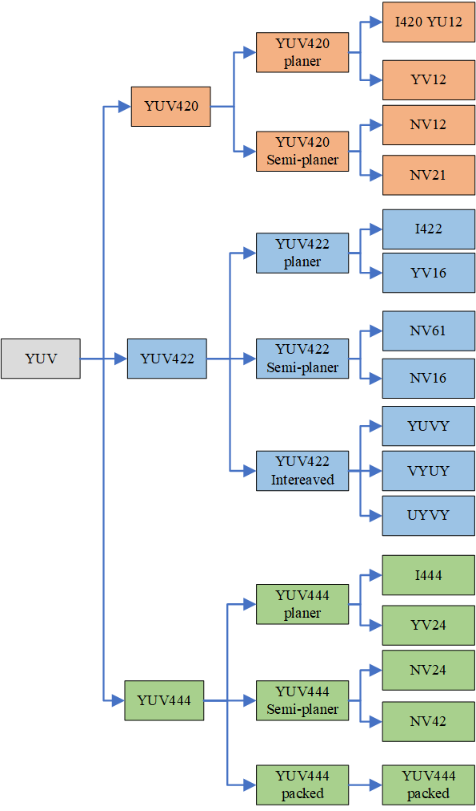
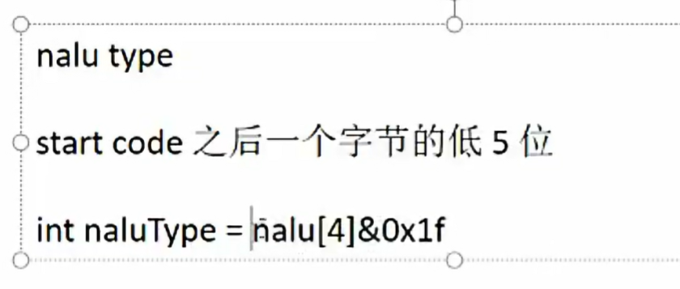
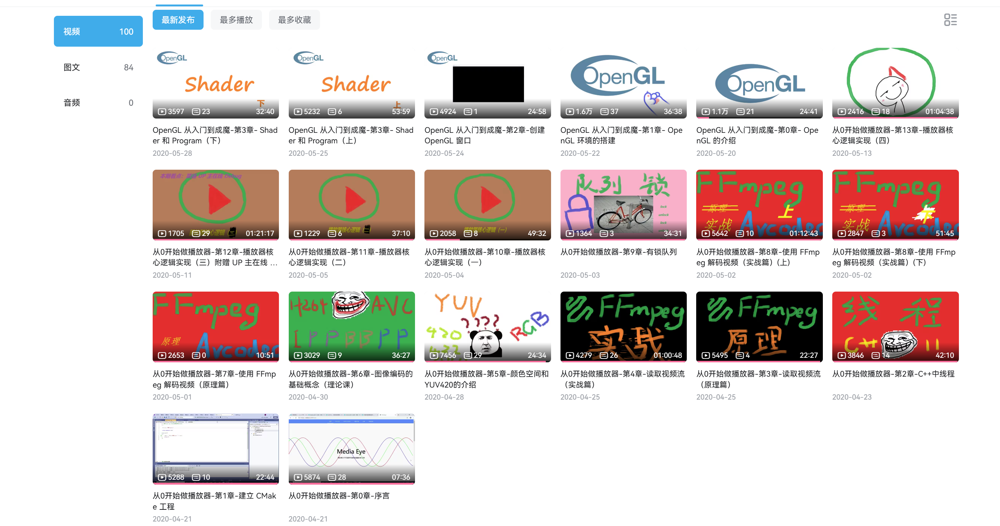

# 从0开始做播放器

## 1 使用cmake建工程

直接新建即可



目录是这样的



```
ProjectName
|_____ProjectName
|_____|___ProjectName.h
|_____|___ProjectName.cpp
|_____|___CMakeLists.txt
|_____CMakeLists.txt
```

头文件和源文件就不用说了。

里层的CMakeLists.txt

```Cmake
# CMakeList.txt: CMakeProject1 的 CMake 项目，在此处包括源代码并定义
# 项目特定的逻辑。
# 指定cmake的版本最低是3.8
cmake_minimum_required (VERSION 3.8)

# 将源代码添加到此项目的可执行文件。
# 将.cpp/.c/.cc文件生成可执行文件
add_executable (CMakeProject1 "CMakeProject1.cpp" "CMakeProject1.h")

# TODO: 如有需要，请添加测试并安装目标。

```

外面的CMakeLists.txt

```cmake
# CMakeList.txt: 顶层 CMake 项目文件，在此处执行全局配置
# 并包含子项目。
#
cmake_minimum_required (VERSION 3.8)
# 项目名称
project ("CMakeProject1")

# 包含子项目。编译子文件夹的CMakeLists.txt
add_subdirectory ("CMakeProject1")

```

边看边学

打开cmake文件



## 2 C++中的线程

ProjectName.cpp

```cpp
// CMakeProject1.cpp: 定义应用程序的入口点。
//

#include "CMakeProject1.h"
#include <thread>
using namespace std;

void threadFunction(int index)
{
	for (int i = 0; i < 1000; i++)
	{
		std::cout << "Thread: " << i << "--" << index << std::endl;
	}
}


int main()
{
	// 创建线程
	std::thread t1(threadFunction, 10);
	std::thread t2(threadFunction, 20);

	// 线程的两种管理方式
	t1.join();					// 线程同步，主线程会等待线程 t 完成后继续运行
	//t.detach();				// 线程分离，线程 t 会独立运行，主线程不会等待它完成
	t2.join();


	system("pause");
	return 0;
}

```

除过加锁，这段代码在运行的时候容易出现资源共享的情况，改进一下，参看Java中的

新建文件夹和文件如图所示



最外面的cmakelist.txt

```cmake
# CMakeList.txt: 顶层 CMake 项目文件，在此处执行全局配置
# 并包含子项目。
#
cmake_minimum_required (VERSION 3.8)

project ("CMakeProject1")

# 包含子项目。
add_subdirectory ("CMakeProject1")
add_subdirectory ("MMThread")

```

MMThread工程下

MMThread.h

```cpp
#pragma once

// 定义一个类
class MMthread
{
public:
	virtual void run() = 0;		// 纯虚函数，线程会调用这个函数
	int start();				// 启动函数
};
```

MMThread.cpp

```cpp
#include "MMThread.h"
#include <thread>


int MMthread::start()
{
	std::thread t(&MMthread::run, this);			// 创建线程，调用自己的纯虚函数，子类继承父类会重新纯虚函数
	t.detach();										// 线程分类

	return 0;
}
```

CMakeList.txt

```cmake
# CMakeList.txt: CMakeProject1 的 CMake 项目，在此处包括源代码并定义
# 项目特定的逻辑。
#
cmake_minimum_required (VERSION 3.8)

# 将源代码添加到此项目的可执行文件。
# 将.cpp/.c/.cc文件生成.a静态库
# 注意，库文件名称通常为libxxx.so，在这里只要写xxx即可
# add_library(库文件名称 STATIC 文件)
add_library(MMThread MMThread.cpp)

# TODO: 如有需要，请添加测试并安装目标。

```

接着修改CmakeProject1工程（图片叫MMPlayer），这个项目要用到前面项目的库，因此，要在当前目录的上一级开始查找；同时还要将用到的库链接进来

CMakeList.txt

```cmake
# CMakeList.txt: CMakeProject1 的 CMake 项目，在此处包括源代码并定义
# 项目特定的逻辑。
#
cmake_minimum_required (VERSION 3.8)

# 从上一级开始查找
include_directories(../)

# 将源代码添加到此项目的可执行文件。
add_executable (CMakeProject1 "CMakeProject1.cpp" "CMakeProject1.h")

# TODO: 如有需要，请添加测试并安装目标。

# 对add_library或add_executable生成的文件进行链接操作
# 注意，库文件名称通常为libxxx.so，在这里只要写xxx即可
# target_link_libraries(库文件名称/可执行文件名称 链接的库文件名称)
target_link_libraries(CMakeProject1 MMThread)
```

CmakeProject1.cpp

```cpp
// CMakeProject1.cpp: 定义应用程序的入口点。
//

#include "CMakeProject1.h"
#include <MMThread/MMThread.h>
#include <chrono>
#include <thread>
using namespace std;

class MyMMThread : public MMthread
{
public:
	// 构造函数
	MyMMThread(int _a) : a(_a) {}

	// 实现父类的纯虚函数
	void run() override
	{
		std::cout << "MyMMthread: " << a << std::endl;
	}
	
private:
	int a;
};


int main()
{
	MyMMThread myThread1(10);			// 创建线程
	// 会调用父类的start函数，父类的start函数创建线程，调用纯虚函数，子类实现了纯虚函数，因此会打印
	myThread1.start();


	MyMMThread myThread2(20);			// 创建线程
	myThread2.start();

	// 休眠2s
	std::this_thread::sleep_for(chrono::seconds(2));


	system("pause");
	return 0;
}

```

测试



## 3 读取视频流（原理篇）

https://ffmpeg.org/about.html

libavutil是一个包含简化编程函数的库，包括随机数生成器、数据结构、数学例程、核心多媒体实用程序等等。

libavcodec是一个包含音频/视频编解码器的解码器和编码器的库。

**libavformat是一个包含多媒体容器格式的拆装器和拆装器的库。**

libavdevice是一个包含输入和输出设备的库，用于抓取和呈现许多常见的多媒体输入/输出软件框架，包括Video4Linux、Video4Linux2、VfW和ALSA。

libavfilter是一个包含媒体过滤器的库。
libswscale是一个执行高度优化的图像缩放和色彩空间/像素格式转换操作的库。

libswresample是一个执行高度优化的音频重采样，重矩阵和样本格式转换操作的库。



> **编码前的数据：AVFrame**
>
> **编码后的数据：AVPacket**
>
> **解码前的数据：AVPacket**
>
> **解码后的数据：AVFrame**

### 1. 初始化 FFmpeg

- **`av_register_all()`**: 注册 FFmpeg 支持的所有解码器、编码器、格式等。

- **`avformat_network_init()`**: 初始化网络支持（如果需要从网络流中读取数据）。

  全局调用一次即可。

### 2. 创建和初始化 `AVFormatContext`

- **`avformat_alloc_context()`**: 分配一个 `AVFormatContext`，它是 FFmpeg 中用于管理多媒体文件或流的核心结构。
- 返回值是一个指向 `AVFormatContext` 的指针。

### 3. 打开输入文件或流

- **`avformat_open_input()`**: 打开一个输入文件或流，并将其信息加载到 `AVFormatContext` 中。
- 这一步会解析文件格式（如 MP4、AVI 等），并为后续的流处理做准备。

### 4. 获取流信息

- **`avformat_find_stream_info()`**: 获取输入文件或流的详细信息，包括音视频流的编码格式、帧率、分辨率等。
- 这一步会填充 `AVFormatContext` 中的 `AVStream` 信息。

### 5. 读取帧数据

- **`av_read_frame()`**: 从输入文件或流中读取一帧数据。
- 每次调用 `av_read_frame()` 会返回一个 `AVPacket`，它包含了一帧的编码数据。
- 如果读取成功，继续处理帧数据；如果读取失败或到达文件末尾，则停止。

### 6. 解码帧数据

- **`AVPacket`**: 包含编码的帧数据（如压缩的视频或音频数据）。
- **`AVFrame`**: 包含解码后的帧数据（如解压缩后的视频或音频数据）。
- `AVPacket` 需要通过解码器（如 `avcodec_send_packet()` 和 `avcodec_receive_frame()`）解码为 `AVFrame`。

### 7. 关闭输入流

- **`avformat_close_input()`**: 关闭输入文件或流，并释放相关资源。
- 这一步会释放 `AVFormatContext` 中的所有流信息。

### 8. 释放 `AVFormatContext`

- **`avformat_free_context()`**: 释放 `AVFormatContext` 及其占用的内存。

简化版：

1. 初始化 FFmpeg 环境。
2. 创建并初始化 `AVFormatContext`。
3. 打开输入文件或流，获取流信息。
4. 循环读取帧数据（`AVPacket`），并通过解码器解码为 `AVFrame`。
5. 处理解码后的帧数据（如播放、保存等）。
6. 关闭输入流并释放资源。

## 4 读取视频流（实战篇）

先下载ffmpeg库：https://gitcode.com/open-source-toolkit/81401/?utm_source=tools_gitcode&index=top&type=card

拷贝dev下的lib和include到3rdpart，vs中也有了



需要在MMAV.cpp中引用ffmpeg的头文件，修改cmakelists.txt

代码参考这里：https://github.com/StudyWinter/MMAVPlayer

## 5 颜色空间和YUV420的介绍

如何表示图像

- 矢量图

不会失真、体积小，不是所有都试用，表现能力有限

- 位图


颜色空间

- RGB

RGB颜色模型即红绿蓝颜色模型。由模仿生物视网膜三种视锥细胞产生，之后通过三原色叠加来进行彩色图像显示。通过在黑色上不断叠加三原色来显示不同的颜色。在RGB颜色空间中，分别将RGB作为笛卡尔坐标系中XYZ坐标系产生。每一个颜色取值范围为[0,256)


- YUV

YUV(亦称YCrCb)是被欧洲电视系统所采用的一种颜色编码方法。采用YUV色彩空间的重要性是它的亮度信号Y和色度信号U、V是分离的。**如果只有Y信号分量而没有U、V信号分量，那么这样表示的图像就是黑白灰度图像。**彩色电视采用YUV空间正是为了用亮度信号Y解决彩色电视机与黑白电视机的兼容问题，使黑白电视机也能接收彩色电视信号。其中“Y”表示明亮度（Luminance或Luma），也就是灰阶值；而“U”和“V” 表示的则是色度（Chrominance或Chroma，作用是描述影像色彩及饱和度，用于指定像素的颜色。“亮度”是透过RGB输入信号来建立的，方法是将RGB信号的特定部分叠加到一起。“色度”则定义了颜色的两个方面─色调与饱和度，分别用Cr和Cb来表示。其中，Cr反映了RGB输入信号红色部分与RGB信号亮度值之间的差异。而Cb反映的是RGB输入信号蓝色部分与RGB信号亮度值之同的差异。

YUV和RGB互相转换的公式如下:

```
Y = 0.299R + 0.587G + 0.114B
U = -0.147R - 0.289G + 0.436B
V = 0.615R - 0.515G - 0.100B

R = Y + 1.14V
G = Y - 0.39U - 0.58V
B = Y + 2.03U
```

- HSV

RGB可以方便的进行计算机存储和读取，但对人进行颜色判断十分不友好，因此有了HSV，HSI颜色空间。HSV即色相(Hue)、饱和度(Saturation)、明度(Value)，又称HSB(B即Brightness)。

H色相是色彩的基本属性，就是平常说的颜色的名称，如红色、黄色等。饱和度，用角度度量，取值范围为0°～360°，从红色开始按逆时针方向计算，红色为0°，绿色为120°,蓝色为240°。它们的补色是：黄色为60°，青色为180°,品红为300°。

S是指色彩的纯度，越高色彩越纯，低则逐渐变灰，取0-100%的数值。

明度V，取0-max(计算机中HSV取值范围和存储的长度有关)。明度表示颜色明亮的程度，对于光源色，明度值与发光体的光亮度有关；对于物体色，此值和物体的透射比或反射比有关。通常取值范围为0%（黑）到100%（白）。

- LAB

**Lab色彩空间**（Lab color space）是颜色-对立空间，带有维度**L**表示亮度，**a**和**b**表示颜色对立维度，基于了非线性压缩的CIE XYZ色彩空间。Lab颜色被设计来接近人类视觉。它致力于感知均匀性，它的L分量密切匹配人类亮度感知。

### YUV 420

首先先介绍一下 YUV，我们都知道，YUV 是一种表示颜色的模型。但是我们常说的 YUV ，其实指的是 YCbCr，**其中Y是指亮度分量，Cb指蓝色色度分量，而Cr指红色色度分量，**是标准 YUV 的一个翻版，此文中，我们就用 YUV 指代 YCbCr 了。

分类：



- 按排列的方式分类：

planer模式

packet模块

半planer模式

- 按uv分量的占比分类：

YUV 420

YUV 422

YUV 444

首先，我们可以将 YUV 格式按照数据大小分为三个格式，YUV 420，YUV 422，YUV 444。由于人眼对 Y 的敏感度远超于对 U 和 V 的敏感，所以有时候可以多个 Y 分量共用一组 UV，这样既可以极大得节省空间，又可以不太损失质量。这三种格式就是按照人眼的特性制定的。

- **YUV 420，由 4 个 Y 分量共用一套 UV 分量，**
- **YUV 422，由 2 个 Y 分量共用一套 UV 分量**
- **YUV 444，不共用，一个 Y 分量使用一套 UV 分量**

我们将可以按照 YUV 的排列方式，再次将 YUV 分成三个大类，Planar，Semi-Planar 和 Packed。

- **Planar YUV 三个分量分开存放**
- **Semi-Planar Y 分量单独存放，UV 分量交错存放**
- **Packed YUV 三个分量全部交错存放**

### 具体分类

#### I420（属于 YUV 420 Plannar）

I420 是 YUV 420 Planar 的一种，YUV 分量分别存放，先是 w * h 长度的 Y，后面跟 w * h * 0.25 长度的 U， 最后是 w * h * 0.25 长度的 V，总长度为 w * h * 1.5。

```
Y Y Y Y Y Y
Y Y Y Y Y Y
Y Y Y Y Y Y
Y Y Y Y Y Y
Y Y Y Y Y Y
Y Y Y Y Y Y
U U U
U U U
U U U
V V V
V V V
V V V
```

#### YV12（属于 YUV 420 Plannar）

YV12 是 YUV 420 Planar 的一种，YUV 分量分别存放，先是 w * h 长度的 Y，后面跟 w * h * 0.25 长度的 V， 最后是 w * h * 0.25 长度的 U，总长度为 w * h * 1.5。与 I420 不同的是，YV12 是先 V 后 U

```
Y Y Y Y Y Y
Y Y Y Y Y Y
Y Y Y Y Y Y
Y Y Y Y Y Y
Y Y Y Y Y Y
Y Y Y Y Y Y
V V V
V V V
V V V
U U U
U U U
U U U
```

#### NV12（属于 YUV 420 Semi-Planar）

NV12 是 YUV 420 Semi-Planar 的一种，Y 分量单独存放，UV 分量交错存放，UV 在排列的时候，从 U 开始。总长度为 w * h * 1.5。

```
Y Y Y Y Y Y
Y Y Y Y Y Y
Y Y Y Y Y Y
Y Y Y Y Y Y
Y Y Y Y Y Y
Y Y Y Y Y Y
U V U V U V
U V U V U V
U V U V U V
```

#### NV21（属于 YUV 420 Semi-Planar）

NV21 是 YUV 420 Semi-Planar 的一种，Y 分量单独存放，UV 分量交错存放，与 NV12 不同的是，UV 在排列的时候，从 V 开始。总长度为 w * h * 1.5。

```
Y Y Y Y Y Y
Y Y Y Y Y Y
Y Y Y Y Y Y
Y Y Y Y Y Y
Y Y Y Y Y Y
Y Y Y Y Y Y
V U V U V U
V U V U V U
V U V U V U
```

#### I422（属于 YUV 422 Plannar）

I422 是 YUV 422 Planar 的一种，YUV 分量分别存放，先是 w * h 长度的 Y，后面跟 w * h * 0.5 长度的 U， 最后是 w * h * 0.5 长度的 V，总长度为 w * h * 2。

```
Y Y Y Y Y Y
Y Y Y Y Y Y
Y Y Y Y Y Y
Y Y Y Y Y Y
Y Y Y Y Y Y
Y Y Y Y Y Y
U U U U U U
U U U U U U
U U U U U U
V V V V V V
V V V V V V
V V V V V V
```

#### YV16（属于 YUV 422 Plannar）

YV16 是 YUV 422 Planar 的一种，YUV 分量分别存放，先是 w * h 长度的 Y，后面跟 w * h * 0.5 长度的 V， 最后是 w * h * 0.5 长度的 U，总长度为 w * h * 2。与 I422 不同的是，YV16 是先 V 后 U

```
Y Y Y Y Y Y
Y Y Y Y Y Y
Y Y Y Y Y Y
Y Y Y Y Y Y
Y Y Y Y Y Y
Y Y Y Y Y Y
V V V V V V
V V V V V V
V V V V V V
U U U U U U
U U U U U U
U U U U U U
```

#### NV16（属于 YUV 422 Semi-Planar）

NV16 是 YUV 422 Semi-Planar 的一种，Y 分量单独存放，UV 分量交错存放，UV 在排列的时候，从 U 开始。总长度为 w * h * 2。

```
Y Y Y Y Y Y
Y Y Y Y Y Y
Y Y Y Y Y Y
Y Y Y Y Y Y
Y Y Y Y Y Y
Y Y Y Y Y Y
U V U V U V
U V U V U V
U V U V U V
U V U V U V
U V U V U V
U V U V U V
```

#### NV61（属于 YUV 422 Semi-Planar）

NV61 是 YUV 422 Semi-Planar 的一种，Y 分量单独存放，UV 分量交错存放，UV 在排列的时候，从 V 开始。总长度为 w * h * 2。

```
Y Y Y Y Y Y
Y Y Y Y Y Y
Y Y Y Y Y Y
Y Y Y Y Y Y
Y Y Y Y Y Y
Y Y Y Y Y Y
V U V U V U
V U V U V U
V U V U V U
V U V U V U
V U V U V U
V U V U V U
```

#### YUVY（属于 YUV 422 Interleaved）

YUVY 属于 YUV 422 Interleaved 的一种。事实上，Interleaved 是属于 Packed 的，但是在 422 中，用 Interleaved 更加形象一些。在 Packed 内部，YUV 的排列顺序是 Y U V Y，两个 Y 共用一组 UV。

```
Y U V Y   Y U V Y   Y U V Y
Y U V Y   Y U V Y   Y U V Y
Y U V Y   Y U V Y   Y U V Y
Y U V Y   Y U V Y   Y U V Y
Y U V Y   Y U V Y   Y U V Y
Y U V Y   Y U V Y   Y U V Y
```

#### VYUY（属于 YUV 422 Interleaved）

VYUY 属于 YUV 422 Interleaved 的一种。在 Packed 内部，YUV 的排列顺序是 VYUY，两个 Y 共用一组 UV。

```
V Y U Y   V Y U Y   V Y U Y
V Y U Y   V Y U Y   V Y U Y
V Y U Y   V Y U Y   V Y U Y
V Y U Y   V Y U Y   V Y U Y
V Y U Y   V Y U Y   V Y U Y
V Y U Y   V Y U Y   V Y U Y
```

#### UYVY（属于 YUV 422 Interleaved）

UYVY 属于 YUV 422 Interleaved 的一种。在 Packed 内部，YUV 的排列顺序是 UYVY，两个 Y 共用一组 UV。

```
U Y V Y   U Y V Y   U Y V Y
U Y V Y   U Y V Y   U Y V Y
U Y V Y   U Y V Y   U Y V Y
U Y V Y   U Y V Y   U Y V Y
U Y V Y   U Y V Y   U Y V Y
U Y V Y   U Y V Y   U Y V Y
```

#### I444（属于 YUV 444 Plannar）

I444 属于 YUV 444 Plannar 的一种。YUV 分量分别存放，先是 w * h 长度的 Y，后面跟 w * h 长度的 U， 最后是 w * h 长度的 V，总长度为 w * h * 3。

```
Y Y Y Y Y Y
Y Y Y Y Y Y
Y Y Y Y Y Y
Y Y Y Y Y Y
Y Y Y Y Y Y
Y Y Y Y Y Y
U U U U U U
U U U U U U
U U U U U U
U U U U U U
U U U U U U
U U U U U U
V V V V V V
V V V V V V
V V V V V V
V V V V V V
V V V V V V
V V V V V V
```

#### YV24（属于 YUV 444 Plannar）

YV24 属于 YUV 444 Plannar 的一种。YUV 分量分别存放，先是 w * h 长度的 Y，后面跟 w * h 长度的 V， 最后是 w * h 长度的 U，总长度为 w * h * 3。与 I444 不同的是，YV24 是先排列 V。

```
Y Y Y Y Y Y
Y Y Y Y Y Y
Y Y Y Y Y Y
Y Y Y Y Y Y
Y Y Y Y Y Y
Y Y Y Y Y Y
V V V V V V
V V V V V V
V V V V V V
V V V V V V
V V V V V V
V V V V V V
U U U U U U
U U U U U U
U U U U U U
U U U U U U
U U U U U U
U U U U U U
```

#### NV24（属于 YUV 444 Semi-Planar）

NV24 是 YUV 444 Semi-Planar 的一种，Y 分量单独存放，UV 分量交错存放，UV 在排列的时候，从 U 开始。总长度为 w * h * 3。

```
Y Y Y Y Y Y
Y Y Y Y Y Y
Y Y Y Y Y Y
Y Y Y Y Y Y
Y Y Y Y Y Y
Y Y Y Y Y Y
U V U V U V U V U V U V 
U V U V U V U V U V U V 
U V U V U V U V U V U V 
U V U V U V U V U V U V 
U V U V U V U V U V U V 
U V U V U V U V U V U V 
```

#### NV42（属于 YUV 444 Semi-Planar）

NV42 是 YUV 444 Semi-Planar 的一种，Y 分量单独存放，UV 分量交错存放，UV 在排列的时候，从 V 开始。总长度为 w * h * 3。

```
Y Y Y Y Y Y
Y Y Y Y Y Y
Y Y Y Y Y Y
Y Y Y Y Y Y
Y Y Y Y Y Y
Y Y Y Y Y Y
V U V U V U V U V U V U
V U V U V U V U V U V U
V U V U V U V U V U V U
V U V U V U V U V U V U
V U V U V U V U V U V U
V U V U V U V U V U V U
```

#### YUV 444 Packed

 三个分量全部交错存放

```
Y U V   Y U V   Y U V   Y U V   Y U V   Y U V
Y U V   Y U V   Y U V   Y U V   Y U V   Y U V
Y U V   Y U V   Y U V   Y U V   Y U V   Y U V
Y U V   Y U V   Y U V   Y U V   Y U V   Y U V
Y U V   Y U V   Y U V   Y U V   Y U V   Y U V
Y U V   Y U V   Y U V   Y U V   Y U V   Y U V
```

具体参考这里：https://www.jianshu.com/p/538ee63f4c1c

## 6 图像编码的基础概念（理论课）

常见编码格式：H264、H265、VP8、VP9、AVS、AVS2

以H264为例

- SPS
  - profile
  - 视频宽度
- PPS
  - 宏块的编码方式
- I帧：不依赖其他帧，自己和自己压缩；（直播场景）
- P帧：根据前面的n帧，通过前面的帧，进行差值得到当前帧；（直播场景）
- B帧：根据前后帧，得到当前帧。

PTS和DTS

- PTS 显示时间戳，表示解码后的帧显示的时间

- DTS 解码时间戳，表示送入解码器的顺序

  ​        I P B B
  PTS:1 4 2 3（播放的时候）
  DTS:1 2 3 4

  

H264存储的两种形态

- Annex B
  - Start Code（NALU）
  - 防竞争字节
  - 多用于网络流媒体中
- AVCC
  - 表示 NALU 长度的前缀，不定长
  - 防竞争字节
  - 多用于文件存储中


NALU（network abstruct  layer unit）

记住1/5/7/8




## 7使用 FFmpeg 解码视频（原理篇）


## 8 使用 FFmpeg 解码视频（实站篇）


## 9 有锁队列


学习：[Redknot-乔红投稿视频-Redknot-乔红视频分享-哔哩哔哩视频](https://space.bilibili.com/38154792/upload/video)



